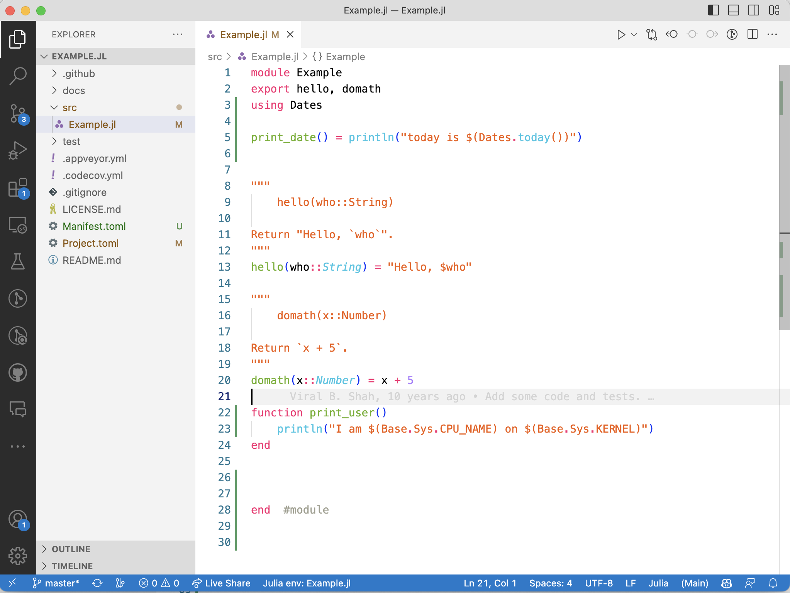
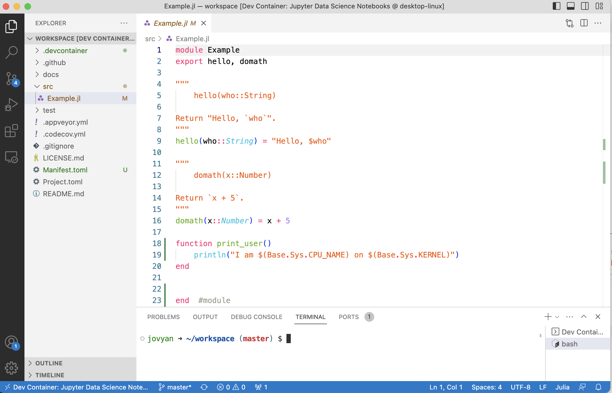
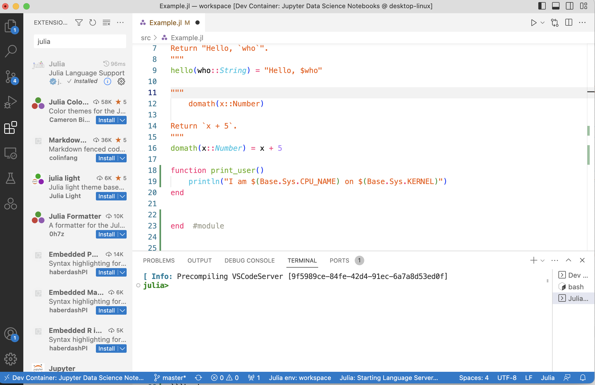
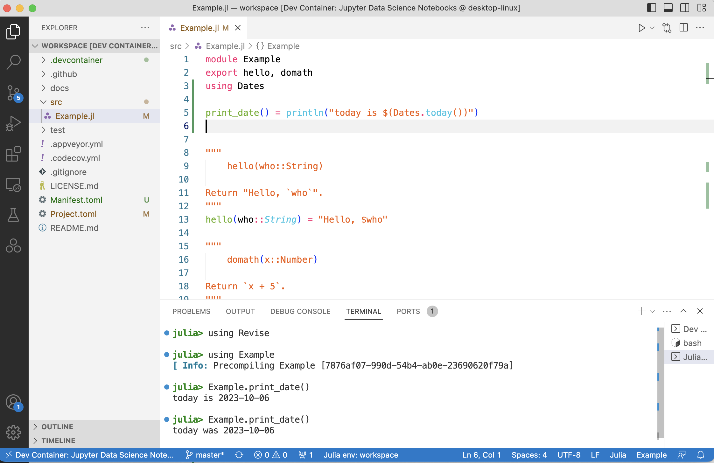

# dev-container-julia

A devevelopment container for julia and jupyterlab that works with VSCode. A development container is a set of settings on top of a docker (or other type) container. It can list features to be installed, which docker file to build, etc.

## Getting started

### System requirements

This is identical to the requirements to running any development container. You can follow these steps or you can get more details on the [VS Code help](https://code.visualstudio.com/docs/devcontainers/containers).

 1. [VScode](https://code.visualstudio.com/), it's free and open source.
 2. [dev container extension ](https://marketplace.visualstudio.com/items?itemName=ms-vscode-remote.remote-containers)
 3. [docker](https://docs.docker.com/engine/install/) 

This will work on Windows, Mac and linux.

### setup 1: Run your exsiting project inside the dev container

This is as simple as creating the container description. You only need to copy the .devcontainer folder in the your project root folder. VSCode will detect it, start the container and make your folder accessible within.  

 1. copy `.devcontainer` folder from this repo to your project. It includes two files, the container description `devcontainer.json` and a `Dockerfile` we wrote that build the container image with all necessary dependencies to run Julia.  

From there, in VSCode you access your file, run julia command, start notebooks. You can even access Jupyterlab by going to the `port` tab in VSCode and clicking on the "open in browser".

### setup 2: Start from scratch

Simply copy all the files from the repo to a local folder. VScode will start the container and you can start using julia.


### Worked Example

Suppose we have a julia project on our computer which we want to containerize now. The project is composed of several files, and comes as a standard julia package. In fact, we will use the `Example.jl` package to illustrate. 

1. Create the package: this would be your initial workflow where you create your package locally. You can skip this step if you already have a package. I will clone the `Example.jl` package to illustrate.

```bash
floswald@PTL11077 ~> cd # going home
floswald@PTL11077 ~> git clone git@github.com:JuliaLang/Example.jl.git 
floswald@PTL11077 ~> ls Example.jl/                                                               
LICENSE.md    Project.toml  README.md     docs/         src/          test/
```

Notice that at this point we are, of course, still on our local machine, using our local OS, and we are called by our usual user name:

```bash
floswald@PTL11077 ~> echo $USER                                                                               
floswald
floswald@PTL11077 ~> uname                                                                                    
Darwin
```

2. Let's add a function to the package. We will add a function that prints the current user name and OS. 

```julia
# adding this to src/Example.jl
function print_user()
    println("I am $(Base.Sys.CPU_NAME) on $(Base.Sys.KERNEL)")
end
```



3. See whether it works locally. We can start julia and run the function. 

```bash
floswald@PTL11077 ~> julia --project=Example.jl -e 'using Example; Example.print_user()'
I am apple-m1 on Darwin
```

Ok, so far so good. Now we want to containerize this.

4. Copy the `.devcontainer` folder from this repo to the project root (i.e. `~/Example.jl` in this case). This folder contains two files, the container description `devcontainer.json` and a `Dockerfile` we wrote that builds the container image with all necessary dependencies to run Julia.  

```bash
floswald@PTL11077 ~> cd Example.jl/
# I stored dev-container-julia in ~/git/dev-container-julia, so I copy it from there
floswald@PTL11077 ~/Example.jl> cp -r ../git/dev-container-julia/.devcontainer .
```

5. Make sure your docker daemon is running. You need to install docker from [https://www.docker.com](https://www.docker.com) and start it.

6. Open the `Example.jl` project in VSCode. VSCode will detect the `.devcontainer` folder and ask you whether you want to open it in a container. Click yes. Alternatively, if you have VSCode still open, observe that now you have the `.devcontainer` folder in the explorer. Go into the command palette with `cmd+shift+p` and type "rebuild and reopen in container". Click on _show log_ to see what is going on: We are pulling a ubuntu image from the docker hub, and then we are building the container image on top of it. This will take a while the first time around. 
7. Check your docker hub: our julia dev container is now running. Go back to VSCode.
8. You see exactly the same content as before: those are the same files you created. Our `print_user` function is still there. But look in the terminal below: the current user is called `jovyan`, and the heading of the window is different now:




9.  Let's run our `print_user` function:
    ```bash
    jovyan ➜ ~/workspace (master) $ julia --project=. -e 'using Example; Example.print_user()'
    I am generic on Linux
    ```
10. Notice that the complete file structure is preserved from before. Like for example, the remote host for this repository is still the original one:
    ```bash
    jovyan ➜ ~/workspace (master) $ git remote --v
    origin  git@github.com:JuliaLang/Example.jl.git (fetch)
    origin  git@github.com:JuliaLang/Example.jl.git (push)
    ```
11. How do work with this now? For one, you can just call julia from the built-in terminal, we have done above. But that's not all. You can also install the julia-vscode extension into the container instance, by clicking left in vscode on the extensions icon and search for `julia`. After that, you can start an integrated julia REPL exactly as you would on your local machine. For example here, I added `Revise` to the `Example` project, load it, and added and modified a function called `print_date` on the fly without reloading anything. 






## Features

 - the container will automatically be x86 or arm64 native. This is good for performance on M1 mac and PC.
 - the container will pre-build the packages present in the project toml file (so you don't have build every time), it takes time the first time around, and we have not figured out how to cache the downloads between rebuild.
 - the port to Jupyterlab is shared so that you can use it directly inside your browser. You can open it from VS code by using the port tab.
 - can be opened in codespace withouth any modification (right now jupyter notebook doesn't work, but julia does)
 - works everywhere

## Todos

- [ ] prebuild images with some main packages (DataFrames, Plots, ...)
- [x] add julia extension to the dev container
- [x] figure out caching of package download between image rebuild
  - this can be done by copying artifacts to a local directory and preloading them on startup (to be tested)
- [ ] better documentation
- [ ] create a template for [VSCode templates](https://containers.dev/templates) for access to be easy.
- [ ] trigger container rebuild when Project file is changed.

## Contact, issues

Feel free to open an issue if something is not working.
